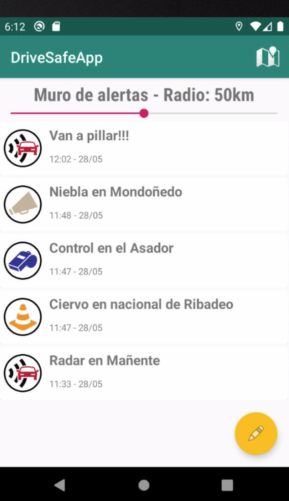
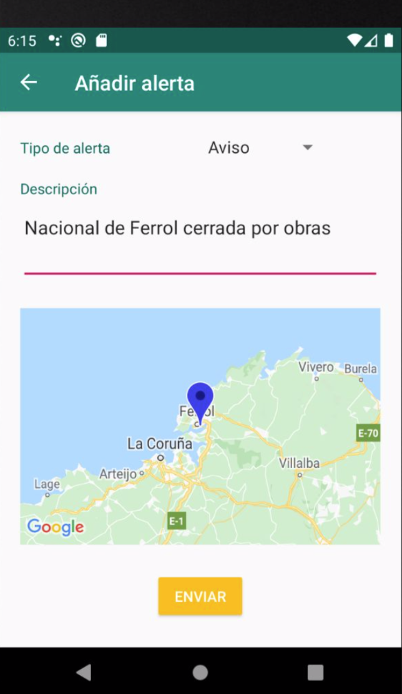
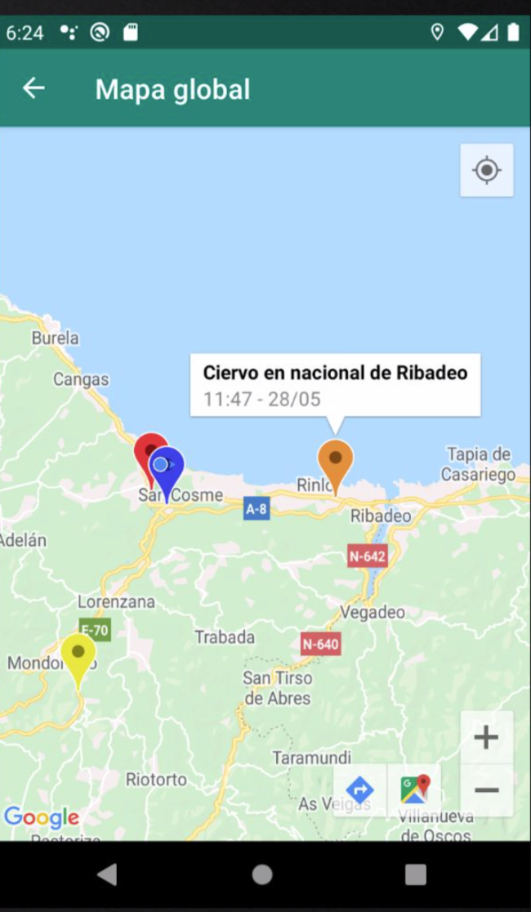
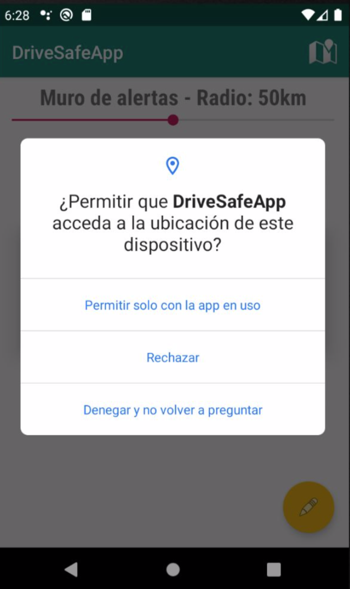

## DriveSafeApp
Android app creada por Alberto Femenias y Raúl Paris

## Descripción
Nuestra aplicación es un clónico de Waze o SocialDrive, esto es, una aplicación destinada a ayudar al conductor a estar informado de todos los percances que le pueden ocurrir a lo largo del trayecto.
La información se guarda en Alertas, que no son más que entradas en una base de datos en la que se guarda la fecha de la alerta, el tipo de alerta (obstáculo en la vía, radar, aviso, control policial o helicóptero), la fecha de creación, la ubicación y una pequeña descripción asociada.

## Capturas

  
  
  
  

